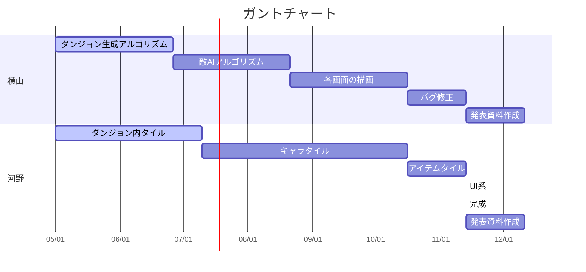
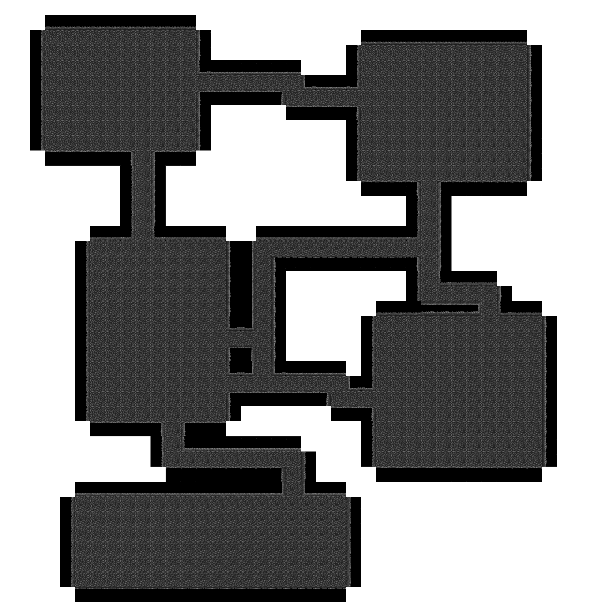

# 卒業制作「ローグライクゲーム」

描いた絵は[**ここ**](/assets)に入れてください

<!--
done            完了したタスク
active          実施中のタスク
crit            クリティカルタスク
ctir, done      完了したクリティカルタスク
crit, active    実施中のクリティカルタスク
-->

```mermaid
gantt
title ガントチャート
dateFormat MM/DD
axisFormat %m/%d

section 横山
ダンジョン生成アルゴリズム: active, y1, 05/01, 8w
敵AIアルゴリズム: y2, after y1, 8w
各画面の描画: y3, after y2, 8w
バグ修正: y4, after y3, 4w
発表資料作成: after y4, 4w

section 河野
ダンジョン内タイル: active, k1, 05/01, 10w
キャラタイル: k2, after k1, 14w
アイテムタイル: k3, after k2, 4w
UI系: k4, after k3, 0w
完成: k5, after k4, 0w
発表資料作成: after k5, 4w
```

