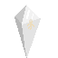

 [](https://github.com/unchunks/Rogue/releases) [](https://github.com/unchunks/Rogue/releases)
# 卒業制作「ローグライクゲーム」

 


## 実行方法
（AppImageから実行）
リリースからAppImageをダウンロードしてください。
```
sudo apt-get install libsdl2-2.0-0 libsdl2-image-2.0-0 libsdl2-ttf-2.0-0 libsdl2-mixer-2.0-0 -y
chmod +x Rogue-x86_64.AppImage
./Rogue-x86_64.AppImage
```

（コンパイルから実行）
まずこのリポジトリをクローンするか、zipファイルをダウンロードして解凍してください。
```
sudo apt-get install make -y
sudo apt-get install g++ -y
cd Rogue
make play
```
AppImageで実行すると、たまに壁の中に敵が湧きます。

## ダンジョンの生成方法一覧
|生成方法  |備考|
|:-------:|:--|
|区域分割法|メジャーな方法です。全体をランダムに分割して、それぞれの領域に部屋を作ります。|
|RRA      |Random Room Assignmentだと長いので、格好つけて略してます。生成方法は名前のとおりです。|

## キャラクター一覧
プレイヤーは ```（現在のレベル） * 100```のEXPでレベルアップ  
（例）Lv.1→Lv.2　100EXP（総EXP100）
　　　Lv.2→Lv.3　200EXP（総EXP300）
|敵の種族         |アイコン                               |HP  |ATK |DEF |EXP|
|:-------------:|:-----------------------------------:|:--:|:--:|:--:|:--|
|born（プレイヤー）|             | 100|  20|  20|なし|
|deka           |             |  70|  10|  10| 10|
|guri           |             |  30|  25|   5| 17|
|jelyf          |           |  40|  20|   5|  7|
|yummy          |           | 100|   5|   5| 18|
|crystal        |       |  50|   1|  30| 10|
|grosspider     | |  40|   7|   7|  7|
|iron           |             |  50|   8|  10| 15|
|tatsu          |           |  30|  20|  15|  7|
|ball           |             |  20|  15|  20|  5|

## ダンジョンのサンプル画像

